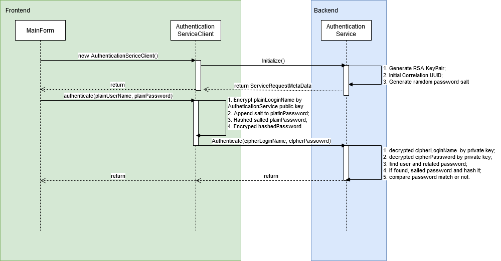

# Summary
A Java demo of secure login protocol with username and password using following technique(s):
- Random number generator
- Nonce
- Encryption Algorithms (AES, Blowfish, RSA… etc)
- Hash Algorithms (MD5, SHA… etc)

# Sequence Diagram

